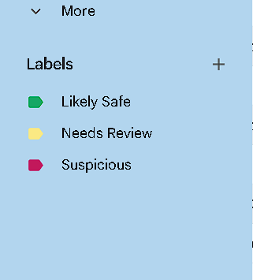
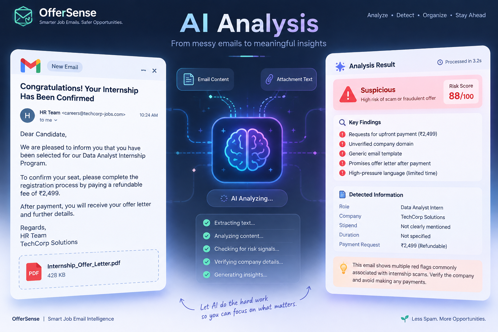

<p align="center">
  
</p>

<h1 align="center">🛡️ OfferSense</h1>

<p align="center">
  <strong>AI-Powered Job Email Assistant</strong>
</p>

<p align="center">
Automatically analyze job & internship emails, detect suspicious offers, extract attachment content, and intelligently organize your Gmail — so genuine opportunities never get buried under scams and noise.
</p>

<p align="center">


</p>

<p align="center">
  <a href="#-overview">Overview</a> •
  <a href="#-features">Features</a> •
  <a href="#-demo">Demo</a> •
  <a href="#-how-it-works">How It Works</a> •
  <a href="#-tech-stack">Tech Stack</a> •
  <a href="#-getting-started">Getting Started</a> •
  <a href="#-roadmap">Roadmap</a>
</p>

---

## 📌 Overview

Every day, students and job seekers apply to dozens — even hundreds — of jobs and internships.

As applications pile up, inboxes quickly fill with interview invitations, assessments, newsletters, promotional spam, and — worst of all — convincing fake job offers. Manually reviewing every email is slow, tedious, and risks missing genuine opportunities or falling for a scam.

**OfferSense** is an AI-powered n8n automation that reads incoming job-related emails, extracts attachment content, flags risk signals, and auto-organizes Gmail using intelligent classification — so you spend your time applying, not sorting.

---

## ✨ Features

| | |
|---|---|
| 📧 | Detects job & internship emails automatically |
| 🤖 | AI-powered analysis of email content and intent |
| 📄 | Extracts text from PDF attachments |
| 🚨 | Flags suspicious payment or registration-fee requests |
| 🔍 | Identifies common scam indicators |
| 🟢 | **Likely Safe** classification |
| 🟡 | **Needs Review** classification |
| 🔴 | **Suspicious** classification |
| 🏷️ | Automatic Gmail labeling |
| ⚡ | Fully automated, hands-off n8n workflow |

---

## 🎥 Demo

<p align="center">
  
</p>

---

## 📸 Screenshots

<table align="center">
<tr>
<td align="center"><strong>Workflow</strong></td>
</tr>
<tr>
<td></td>
</tr>
</table>

<table align="center">
<tr>
<td align="center"><strong>Gmail Labels</strong></td>
</tr>
<tr>
<td></td>
</tr>
</table>

<table align="center">
<tr>
<td align="center"><strong>AI Analysis</strong></td>
</tr>
<tr>
<td></td>
</tr>
</table>

---

## ⚙️ How It Works

```text
📥 New Gmail Email
        │
        ▼
🔎 Job Email Detection
        │
        ▼
📎 Attachment Extraction
        │
        ▼
🧠 AI Analysis
        │
        ▼
🗂️ Structured Output
        │
        ▼
🚦 Risk Classification
        │
        ▼
🏷️ Automatic Gmail Label
```

---

## 🧠 Risk Categories

| Status | Meaning |
|:---:|---|
| 🟢 **Likely Safe** | No significant risk indicators detected |
| 🟡 **Needs Review** | Some elements require manual verification |
| 🔴 **Suspicious** | Multiple indicators suggest a potential scam |

---

## 🛠 Tech Stack

| Category | Technology |
|---|---|
| ⚡ Automation | [n8n](https://n8n.io) |
| 🤖 AI Model | [Groq](https://groq.com) |
| 📧 Email | Gmail API |
| 🧩 Workflow Engine | AI Agent |
| 🗂️ Parsing | Structured Output Parser |
| 📄 Document Processing | PDF Text Extraction |

---

## 📂 Project Structure

```text
OfferSense
├── workflow
│   └── offersense.json
│
├── assets
│   ├── banner.png
│   ├── demo.gif
│   ├── workflow.png
│   ├── gmail-labels.png
│   └── analysis.png
│
├── README.md
└── LICENSE
```

---

## 🚀 Getting Started

1. **Clone the repo**
   ```bash
   git clone https://github.com/tenacious7/OfferSense.git
   ```
2. **Import the workflow** — open your n8n instance and import `workflow/offersense.json`.
3. **Connect credentials** — link your Gmail account and add your Groq API key in the workflow's AI node.
4. **Activate** — turn the workflow on, and let OfferSense start triaging your inbox automatically.

---

## 🧭 Roadmap

- [ ] Company verification
- [ ] Website & domain reputation analysis
- [ ] URL safety detection
- [ ] OCR fallback for scanned attachments
- [ ] Browser extension
- [ ] Analytics dashboard
- [ ] Multi-language support

---

## 💡 Why I Built This

During my internship and job search, I realized the biggest challenge wasn't applying — it was managing the flood of emails that followed.

Important opportunities often got buried, while fake internship offers looked convincing enough to waste time or even trick applicants into paying unnecessary registration fees.

I built **OfferSense** to automate that review process — flagging suspicious offers, extracting what matters, and keeping my inbox organized — so I could focus on real opportunities instead of sorting through noise.

---

## ⭐ Support

If you found this project useful, consider giving it a star.

It helps others discover the project and keeps the motivation going for future improvements.

---

## 📄 License

This project is licensed under the MIT License.
